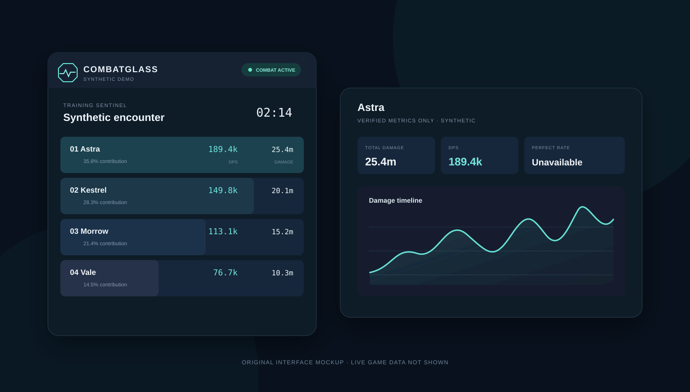

  

<h1 align="center">CombatGlass</h1>

<strong>See the fight. Touch nothing.</strong>

Real-time combat clarity for AION 2 Global, designed first for the European community and usable anywhere—without touching the game.

  <strong>Local processing</strong> · <strong>No account</strong> · <strong>No telemetry</strong> · <strong>No memory reading</strong> 
  <strong>No injection</strong> · <strong>No packet modification</strong> · <strong>No automation</strong> · <strong>Free</strong>

> **Public development preview — downloads are not available yet.**  
> AION 2 Global protocol support: **awaiting live validation**.

## Combat data without the clutter

CombatGlass is being built as a focused Windows combat analyzer. The default
view keeps the essentials readable at a glance: encounter state, time, player,
DPS, total damage and contribution. Detailed analysis stays one click away.

It is intended to remain completely free initially, without subscriptions,
premium combat features, a paywall or a licence server. Optional coffee support
may be added only after the maintainer configures a verified destination; no
donation link is live today.

- Calm, adjustable overlay designed for Windows 10 and 11
- Local, bounded encounter history
- Skill contribution and damage timeline when the protocol supports them
- Streamer Mode with stable per-encounter aliases
- Demo Mode with clearly synthetic data and no game or capture driver required
- Unsupported statistics display as **Unavailable**, never believable zeroes

## Languages

The desktop interface and public product site are available in English,
Deutsch, Français, Español, Português (Brasil) and Русский. English is the
canonical fallback. Language detection and preferences stay local; there is no
IP geolocation, account or locale telemetry. Translations are AI-assisted and
awaiting review by native speakers and AION 2 community members.

## The boundary is the product

CombatGlass is not a bot, VPN, game modification or injector. Its architecture
forbids game-process access, input automation and packet transmission. The live
capture path will only observe narrowly filtered traffic already received by the
computer. If the protocol cannot be trusted, combat data stops.

| CombatGlass does | CombatGlass does not |
|---|---|
| Process verified combat observations locally | Read or write AION 2 memory |
| Aggregate bounded combat metrics | Inject code or hook graphics APIs |
| Keep opted-in history on your PC | Send, modify, delay or proxy game packets |
| Let you delete local history | Automate skills, movement, targeting or input |

Read the full [Privacy promise](PRIVACY.md) and [security model](SECURITY.md).

## How it will work

1. A receive-only capture component observes a narrow set of relevant traffic.
2. Strict, bounded parsers reject malformed, unknown or changed protocol data.
3. Combat events are aggregated away from the UI thread.
4. The overlay receives only the metrics it needs to draw.

Npcap is the current candidate capture dependency. It will not be silently
installed or bundled without appropriate redistribution rights. The full app
will not run as Administrator; if elevation proves necessary, it will be limited
to a small capture helper.

## Status

The private application is in active development. Demo Mode, the product UI,
bounded encounter engine, replay foundation, TCP reassembly and strict parser
contracts exist. Live capture and AION 2 Global decoding remain disabled until
traffic can be validated independently.

No executable, installer, portable archive or nightly build is available.

## Roadmap

- **Now:** polish Demo Mode, UI, replay coverage, privacy and release safeguards
- **Next:** controlled AION 2 Global traffic validation and protocol confidence records
- **Then:** capture hardening, clean-VM testing, performance measurement and signing review
- **Only after approval:** first manually approved, hashed and reviewed Windows release

## Questions and support

Start with the [FAQ](FAQ.md). For a bug or product idea, use the repository issue
templates. Please never attach packet captures, tokens, private logs or personal
information to a public issue. See [Support](SUPPORT.md) for safe reporting.

CombatGlass will be completely free. If it helps your raid in the future, an
optional coffee link may appear here—never in combat and never as a paywall.

---

CombatGlass is an independent third-party project and is not affiliated with or
endorsed by NC. A passive design does not justify promises about account safety.
See the full [Disclaimer](DISCLAIMER.md). CombatGlass is closed-source freeware;
this public repository contains product documentation and original brand assets,
not application source code.
